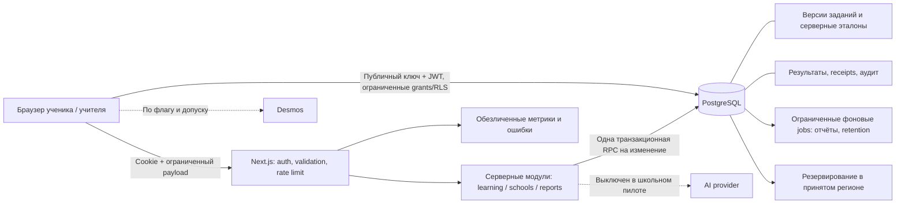

# AlemPrep: архитектура production и пилота двух школ

Дата: 09.09.2026. Статус: проект архитектуры для реализации; **не свидетельство готовности работающего сайта**.
Заказ: две сельские школы Актюбинской области, полноценные RU/KK, кабинет учителя, достоверные результаты и отчёт управлению образования, устойчивость и безопасность, Desmos API.
Навигация и порядок исполнения: [главный план](../../production/README.md).

## 1. Решение технического руководителя

Сохраняем модульный монолит Next.js + PostgreSQL, Supabase Auth/Data API там, где допустим выбранный контур размещения. Server Actions — транспорт, небольшие серверные модули — бизнес-правила, PostgreSQL — целостность и изоляция. Браузер не является источником баллов, ролей, дат завершения, квот или подтверждённой принадлежности к школе.

Рассмотренные варианты:

| Вариант | Плюс | Цена/риск | Решение |
| --- | --- | --- | --- |
| Укрепить текущий монолит, транзакционные RPC, RLS | Переиспользуем тренажёр и интерфейс; меньше компонентов на дежурстве | Нужны реальные DB-тесты и дисциплина привилегированных запросов | Основной путь |
| Отдельный backend + очередь + Redis сразу | Больше независимых способов масштабирования | Два релиза, новая авторизация, сеть, очереди и больше мест отказа до двух школ | Только при измеренном пределе текущего решения |
| Полностью переписать платформу/самостоятельно обслуживать весь стек | Контроль инфраструктуры и размещения | Миграция Auth, обновления, восстановление и круглосуточная эксплуатация | Только если решение о размещении требует этого; не выбирать VPS без ответственного |

Физическое размещение — отдельное обязательное решение D02. Портируемая SQL-схема не делает автоматически законными обработку на Vercel, Google OAuth или зарубежные логи. До D02 — только синтетические данные на новом стенде.

## 2. Непереговорные требования

- RU/KK: ключи сообщений в паритете, контент пилота принят человеком по математике и казахскому языку.
- TypeScript strict; не добавлять `any`, `@ts-ignore`, двойные приведения для обхода схемы.
- Существующие design tokens, темы и согласованный дизайн визуализации сохраняются.
- Новые миграции; применённые SQL-файлы, `.env.local` и материалы презентации не изменяются.
- Одна принятая операция даёт один результат и один логический audit event; сетевой retry не создаёт новый учебный факт.
- Проверка схемы/прав и конкурентных записей проходит на реальном PostgreSQL с ролями `anon`, `authenticated`, `service_role`.
- Подтверждённый результат не зависит от localStorage, клиентского времени или скрытой кнопки.
- Секреты, дампы, детские данные и персональные выгрузки не попадают в Git, CI artifacts, публичные preview или логи.
- Учитель имеет доступ только к закреплённым группам; назначить себе роль через браузер нельзя.
- AI и Desmos для школьного контура выключены до отдельных допусков. Сейчас это требование, а не реализованный флаг.
- Запуск детей запрещён до закрытия G0–G7 из главного плана. Условное «тесты зелёные» не заменяет отсутствующие доказательства.

## 3. Границы доверия



Прямой Data API рассматриваем как реальную поверхность атаки даже при использовании Server Actions. `service_role` обходит RLS: все его обращения проходят через серверные модули с явно полученным actor ID, проверкой scope в транзакции и закрытым `EXECUTE` у публичных ролей. Политики не защищают от украденного service key: нужны секреты, минимальный доступ команды и ротация.

## 4. Границы модулей и файлов

| Модуль | Файлы назначения | Ответственность |
| --- | --- | --- |
| Auth/конфигурация | `lib/server/config.ts`, `lib/server/actor.ts`, `lib/supabase/admin.ts` | `server-only`, проверенные env, текущий пользователь через `auth.getUser()`, доверенные роли |
| Учебные контракты | `lib/learning/contracts.ts`, `validation.ts`, `grading.ts` | DTO без ответов, ограниченные входы, действующая версия scoring |
| Учебная запись | `lib/learning/service.ts`, `repository.ts` | Выдать серверный manifest, оценить immutable версии, вызвать atomic RPC |
| Старые actions | `lib/supabase/practice-actions.ts`, `diagnostic-actions.ts`, `weekly-actions.ts` | Тонкие совместимые адаптеры в новый сервис; публичные обходные writes удаляются |
| Контент | `lib/content/public-question.ts`, `versions.ts`, `pilot-catalog.ts` | Библиотека опубликованных версий, RU/KK пары и принятое подмножество |
| Школы | `lib/pilot/contracts.ts`, `access.ts`, `repository.ts`; `lib/supabase/pilot-actions.ts` | Членство, приглашения, группы, назначения; изменения через RPC |
| Чтение | `lib/supabase/queries.ts`, `lib/supabase/queries/learning.ts`, `pilot.ts`, `reports.ts` | Сохраняем старый entrypoint, выносим изменяемые части; только явные поля, pagination |
| Отчёты | `lib/reporting/contracts.ts`, `metrics.ts`, `csv.ts`, `service.ts` | Метрики из доверенных фактов, snapshot отчёта, безопасный экспорт |
| Клиент | существующие `components/practice/*`, новые `components/teacher/*`, `lib/learning/pending.ts` | Ответы, pending/retry, доступность, UI без privileged правил |
| Операции | `lib/operations/limits.ts`, `telemetry.ts`, `jobs.ts`; `scripts/pilot/*` | Квоты, метрики, synthetic checks, восстановление и сверка |
| Desmos | `components/visualization/DesmosPanel.tsx`, `lib/desmos/{loader,presets}.ts` | Один загрузчик, фиксированная проверенная API-версия, lifecycle, fallback |

Не переносить весь `queries.ts` ради красоты. Выносить функцию только при изменении её контракта; оставить совместимый экспорт для оставшихся страниц.

## 5. Модель данных: расширение, а не потеря истории

Физические имена и миграции определяет этот раздел. Все новые `id` — UUID; даты — `timestamptz`, серверное время, отчётный день — `Asia/Almaty`. Ниже контракт новых полей; существующие поля сохраняются до отдельного согласованного удаления.

### 5.1 Контент и учебные факты

| Таблица | Новые поля/ограничения | Доступ |
| --- | --- | --- |
| `question_versions` (новая) | `id`, `question_id` FK RESTRICT, `family_id` UUID, `revision` int >0, `locale`, `type`, `public_body` JSONB без correct, `grading_body` JSONB, `explanation`, `context_snapshot`, `content_hash`, `created_at`; UNIQUE(question_id,revision) | Никакого прямого SELECT anon/authenticated; server-only эталоны. UPDATE/DELETE версии запрещены обычным runtime |
| `question_publications` (новая) | `question_version_id` PK/FK, `status` draft/approved/quarantined, `math_review_ref`, `language_review_ref`, `source_rights_ref`, `updated_at` | Публикация и карантин отдельны от immutable версии, изменяются привилегированной операцией с аудитом |
| `sessions` (расширить) | `integrity_version` smallint default 0; `operation_id` UUID nullable legacy; `status` active/submitted/expired/cancelled; `expires_at`; `scoring_version`; `manifest_hash`; `receipt` JSONB; `assignment_id` nullable FK позже | Пользователь читает свои безопасные поля. INSERT/UPDATE/DELETE только доверенные операции |
| `session_items` (новая) | `id`, `session_id` FK RESTRICT, `question_version_id` FK RESTRICT, `position` int ≥0; UNIQUE(session_id,position), UNIQUE(session_id,question_version_id) | Нет прямого чтения связанной grading версии; DTO возвращает сервис. ID выданного item — ключ ответа |
| `attempts` (расширить) | `session_item_id` nullable FK RESTRICT, `integrity_version` default 0, `points`, `max_points`; UNIQUE(session_item_id) WHERE nonnull | Собственное чтение после commit; клиентские writes закрыты. Старые строки не становятся доверенными от миграции |
| `operation_receipts` (новая) | PK(actor_id,operation_id); `kind`, `payload_hash`, `result` JSONB, `created_at` | RPC-only; не общий публичный журнал операций |
| `reward_ledger` (новая) | `id`, `user_id`, `session_id`, `reward_key`, `amount` ≥0, `day`; UNIQUE(user_id,reward_key,day) | RPC-only, источник начисления без повторов |
| `audit_events` (новая) | `id`, `actor_id` nullable, `actor_kind` user/operator/system, `event_type`, `entity_type`, `entity_id`, `school_id` nullable, `operation_id`, `occurred_at`, `metadata` JSONB по allowlist | Клиенты не пишут/не удаляют. Не хранит ответы, email, cookie, токены и полные payload |

FK `attempts.question_id` сейчас каскадный: заменить новой миграцией на RESTRICT, чтобы удаление контента не стирало результаты. Восстановление/удаление персональных данных выполняет специальная процедура в правильном порядке, не обычный CRUD. `auth.users` cascade проверить отдельно; audit не должен каскадно исчезать с actor. Сроки хранения и обезличивание описаны в D04.

Индексы: attempts(user_id,attempted_at DESC), attempts(session_id), sessions(user_id,started_at DESC), sessions(assignment_id,user_id), session_items(session_id,position), audit_events(school_id,occurred_at DESC,id), audit_events(entity_type,entity_id,occurred_at), operation_receipts(created_at), reward_ledger(user_id,day). Подтверждать EXPLAIN на ожидаемом объёме; не создавать дубликаты существующих индексов.

Миграции зарезервированы после интеграции 0022/0023: `0024_learning_integrity_schema.sql`, `0025_learning_integrity_rpc.sql`, `0026_learning_write_cutover.sql`. До их создания проверить отсутствие совпадающих номеров. Старые миграции не переименовывать, ledger не подделывать.

### 5.2 Школы и назначения

| Таблица | Поля и ограничения |
| --- | --- |
| `schools` | id, name, status active/paused/archived, timezone = Asia/Almaty, created_at |
| `school_memberships` | id, school_id, user_id, role student/teacher/coordinator, joined_at, ended_at; один активный membership на (school,user); роль coordinator — управление пилотом школы, не контент-admin |
| `school_groups` | id, school_id, name, locale ru/kk, status, created_at; UNIQUE(id,school_id) для составных FK |
| `group_memberships` | id, school_id, group_id, school_membership_id, joined_at, ended_at; составные FK исключают смешение школ; частичный UNIQUE активного участника группы |
| `group_teachers` | school_id, group_id, school_membership_id, assigned_at, ended_at; только активный teacher/coordinator той же школы |
| `group_invites` | id, school_id, group_id, token_hash unique, expires_at, max_uses 1..100, uses, revoked_at, created_by; токен 128+ бит, plaintext показывается один раз, не хранится и не логируется |
| `pilot_programs` | id, version, title_ru, title_kk, status draft/approved/retired, review_ref; UNIQUE(id,version) |
| `pilot_program_items` | program_id, position, question_version_id, locale ru/kk, purpose practice/baseline/endline; UNIQUE(program_id,locale,purpose,position); locale/type сверяются с версией; заморожены после approved |
| `assignments` | id, school_id, group_id, program_id, purpose practice/baseline/endline, comparison_baseline_id nullable self FK для endline, opens_at, due_at, closes_at, created_by, status draft/published/cancelled, revision; opens≤due≤closes |
| `assignment_participants` | assignment_id, user_id, school_membership_id, eligible_from, withdrawn_at; UNIQUE(assignment,user); состав при публикации фиксирован, дальнейшие добавления/отзыв отдельно аудируются |

После S02: `sessions.assignment_id` связывает результат с assignment; `sessions.school_membership_id` фиксирует контекст членства на старте. Нельзя вычислять историческую школу по текущей школе пользователя. На submit проверяем активное участие; отзыв участия запрещает новые writes, ранее подтверждённый факт сохраняется по принятой политике.

Учитель другой группы той же школы не видит индивидуальные результаты без назначения. Координатор имеет только свои school scope и агрегат по умолчанию. Глобальный content-admin не получает автоматически школьные персональные данные. Выдача первой teacher/coordinator роли — операторская CLI с проверкой actor и аудитом, не signup metadata.

### 5.3 Отчёты и эксплуатация

- `report_runs`: id, school_id, audience teacher/authority, requested_by, start_at/end_at, cutoff_at, metrics_version, content_versions JSONB, filters JSONB, status queued/running/ready/failed/expired, aggregate_snapshot JSONB, created_at. Готовый snapshot immutable; исправление — новый report ID.
- `report_participants`: report_id + псевдонимизированный внутренний participant reference и необходимые числитель/знаменатель/баллы для аудита. Не отдавать authority. Хранение только по D04; удаление участника инвалидирует/перевыпускает связанный отчёт по процедуре.
- `operation_limits`: scope_hash, action, window_start, count; atomic UPSERT. Scope строит сервер из проверенного user/school, IP только дополнительный сигнал.
- `operation_jobs`: id, kind report/retention/reconcile, payload allowlist, status, lease_until, attempts, next_run_at; уникальный business key. Обработка `FOR UPDATE SKIP LOCKED`, lease и ограниченные retries. Для первого пилота один job runner, без отдельного брокера.
- `pilot_settings`: server-only флаги scope global/school; learning_writes, teacher_exports, desmos_enabled, ai_enabled; version, updated_at. Нет автоматического разрешения при ошибке чтения. AI default false.
- `privacy_requests`: id, subject_user_id, kind export/withdraw/delete, status, requested_at, completed_at, operator_ref. Идентификация заявителя и согласованное основание фиксируются ссылкой в закрытом операционном реестре, не сканом документа в Git.

## 6. Контракты сервиса

Создать `lib/learning/contracts.ts`; UUID проверяется на runtime, TypeScript alias сам по себе не валидация.

```ts
export type Locale = 'ru' | 'kk';
export type LearningMode = 'practice' | 'mock_exam' | 'diagnostic' | 'weekly';
export type Answer = string | string[] | Record<string, string> | null;
export type LearningError = 'unauthenticated' | 'forbidden' | 'invalid-input'
  | 'not-found' | 'expired' | 'already-submitted' | 'operation-conflict'
  | 'content-unavailable' | 'rate-limited' | 'temporarily-unavailable';
export type Result<T> = { ok: true; value: T } | {
  ok: false; error: LearningError; requestId: string; retryAfterMs?: number;
};
export type StartInput = {
  operationId: string; locale: Locale; mode: LearningMode;
  topicSlug?: string; second?: 'physics' | 'informatics'; assignmentId?: string;
};
export type SubmitInput = {
  operationId: string; sessionId: string;
  answers: { itemId: string; answer: Answer; timeSpentMs: number }[];
};
export type Receipt = {
  sessionId: string; acceptedAt: string; score: number; maxScore: number;
  correctCount: number; totalQuestions: number; xpAwarded: number;
  integrityVersion: 1; scoringVersion: 'ent-v1';
};
```

`startLearning(input: StartInput): Promise<Result<StartedLearning>>` и `submitLearning(input: SubmitInput): Promise<Result<Receipt>>` получают actor **внутри** сервиса. `StartedLearning` = `{sessions: StartedSession[]}`; `StartedSession` = `{id:string; mode:LearningMode; expiresAt:string; items:PublicSessionItem[]}`; `PublicSessionItem` = `{id:string; position:number; question:PublicQuestion}`. `PublicQuestion` = `{id:string; type:QuestionType; body:PublicQuestionBody; context:ContextContent|null; locale:Locale; topicLabel:string}`. PublicQuestionBody — union существующих SingleBody/MultiBody/MatchingBody через Omit каждого варианта по ключу correct. Никаких grading_body/correct/explanation до разрешённого разбора. Обычные option IDs остаются публичными: скрывается принадлежность к correct, а не сами варианты.

Для практики один item на сессию. Для пары пробника две сессии создаются одной start-транзакцией. Диагностика/weekly сохраняют нынешние blueprint, но каждый item берётся только из разрешённого каталога. Сервер отказывает при нехватке проверенного контента: не выдаёт неполный школьный замер с обещанным максимумом.

Сроки v1 для реализации: practice2h, diagnostic30min, weekly45min; обе сессии пары mock_exam истекают одновременно через EXAM_PAIR_DURATION_S (сейчас160min) от серверного start. Для assignment взять минимум этого срока и closes_at. Это product policy, не заявление об официальной длительности ЕНТ. Методист C01 подтверждает уместность перед школьным применением; изменение policy получает новую версию. Ответ, поступивший после expires_at, отклоняется; ранее принятый receipt доступен при разрешённом auth даже после expiry.

`getLearningReview(sessionId: string): Promise<Result<LearningReview>>`: только владелец завершённой сессии; для baseline/endline разбор закрыт до `assignment.closes_at`. LearningReview = `{receipt: Receipt; items: {itemId: string; answer: Answer; points: number; maxPoints: number; explanation: Explanation | null; gradingBody: QuestionBody}[]}`; QuestionBody/Explanation — существующие типы `types/db.ts`. Незавершённая сессия не даёт получить ключ через этот endpoint. Контент обычной практики может быть известен из прошлых разборов: платформа не обещает прокторинг или защиту от внешних шпаргалок.

## 7. Атомарное сохранение и повторы

Серверные RPC `start_learning_v1(actor_id uuid, operation_id uuid, payload_hash text, plan jsonb)` и `commit_learning_v1(actor_id uuid, operation_id uuid, payload_hash text, session_id uuid, graded_items jsonb, scoring_version text)` доступны **только service_role**. Они SECURITY INVOKER с полностью квалифицированными именами и фиксированным `search_path`; `REVOKE EXECUTE FROM PUBLIC, anon, authenticated`, затем GRANT service_role. Передача actor ID допустима только из проверенного серверного auth контекста. Не выставлять такую RPC как authenticated функцию с actor из браузера.

Scoring выполняет TypeScript на `question_versions.grading_body`, закреплённом session_items. DB повторно проверяет владельца, статус, manifest, version ID каждого item, полноту item списка, предел points/max_points и назначение. Правильность балла доверена **серверному коду**, не браузеру; SQL не принимает клиентский graded_items напрямую. Тесты scoring — отдельный обязательный слой. Никаких внешних API внутри DB-транзакции.

Порядок блокировок всех операций: (1) advisory transaction lock по actor+operation; (2) профиль actor FOR UPDATE; (3) scope/membership/assignment при наличии; (4) sessions по UUID по возрастанию. Для role revoke тот же scope-lock, чтобы проверка не расходилась с изменением прав. Аудировать длительность/lock timeout. `lock_timeout=2s`, `statement_timeout=5s` — стартовые настройки внутри RPC, уточнить на load test.

Алгоритм commit:

1. Найти receipt по actor+operation. Тот же canonical payload hash → вернуть первоначальный result. Другой hash → operation-conflict без изменений. При replay новой авторизации всё равно требовать действующий аккаунт; receipt не раскрывается другому actor.
2. Проверить session владельца, integrity_version=1, mode, active, срок, доступность школьного участия и learning_writes. Старые NULL manifests не обновлять до v1 на доверии клиенту.
3. Пропущенные items нормализовать сервером в answer=null/points=0. Неизвестные/повторные item IDs, невалидные варианты и типы — invalid-input. MaxScore всегда сумма **выданных** items, не присланных ответов.
4. Вставить attempts на все items, один на item. Установить итог sessions и finished_at только в этой же транзакции. Вставить reward_ledger с ON CONFLICT DO NOTHING, применить только реально добавленную сумму через `xp = xp + delta`.
5. Стрик обновить под тем же profile lock, по DB дню Asia/Almaty; не по браузеру. Достижения — из доверенных фактов. Если пересчёт дорогой, в той же транзакции создать job, показывать бейдж после обработки; XP и результат от job не зависят.
6. Добавить `learning.submitted` в audit_events и operation_receipt. Commit. Ошибка любой обязательной вставки откатывает всё; compensation DELETE из приложения удаляется.
7. Другая операция для уже submitted session возвращает already-submitted и разрешает отдельно прочитать первый receipt. Это не второй submit, XP/аудит не меняются. Потеря HTTP после commit исправляется retry **с тем же operationId**, а не новой попыткой.

Canonical hash включает kind, sessionId, отсортированные по itemId ответы, нормализованные варианты и duration; не включает requestId и серверную оценку. Изменение ответа при pending операции требует дождаться outcome; нельзя менять тело под прежним operationId.

Границы: UUID всех IDs; максимум 80 items на submit; single ≤1 допустимого option ID, multi уникальные option IDs ≤10, matching ключи только выданных left IDs ≤10, строки ID ≤80 символов. Время integer 0..7_200_000 ms — диагностическое, не доказательство учёбы; start/expiry серверные. Payload JSON ≤64 KiB, проверка до дорогих запросов; транспортный limit также ограничить совместимым Next config. Не принимать произвольные URL/SQL/фильтры сортировки.

Награды v1: существующий XP_PER_CORRECT сохраняется, но выдаётся за первую полностью правильную работу с `family_id` в день; дневной предел 200 XP от ответов. Exam bonus — один раз на успешно завершённый блок согласно существующему EXAM_BLOCK_BONUS, максимум два бонуса в день; знаменатель полного manifest. Эти учебные правила фиксируются тестами и текстом интерфейса, не обещают защиту от человека, который уже знает ответ. Старые XP сохраняются как legacy история интерфейса; школьные метрики их не используют.

## 8. Переход без опасного окна

Общий порядок новых миграций: 0024 L01 schema → 0025 L02 RPC → 0026 L04 revoke → 0027 C01 programs → 0028 C02 reports → 0029 S01 scopes → 0030 S02 assignments → 0031 O01 limits/flags → 0032 R01 reports/jobs → 0033 R03 privacy → 0034 O03 индексы при необходимости. Task IDs не равны номерам миграций. Если выбран более ранний AI-off task, он делает только config/code без преждевременной SQL миграции.

1. Примирить ветки и фактическую схему, получить рабочий совместимый baseline. Production не должен оставаться на старом коде, который пытается писать XP с уже отозванными правами.
2. Expand: добавить v1 schema/RPC без закрытия старых writes; v1 включён только на synthetic staging. Existing attempts/sessions остаются integrity_version=0.
3. Перевести все practice/exam/diagnostic/weekly/AI/achievement mutations на разрешённые серверные пути. Прямой экспорт createExamSession с клиентским manifest убрать. Старые активные сессии завершать как cancelled при cutover, предложить начать заново; не начислять задним числом.
4. Короткое объявленное окно обслуживания записей: старое приложение остановлено для writes; применить 0026, которая закрывает клиентские writes и широкие ALL policies; выпустить совместимый code SHA. Все действия отрабатываются на стенде заранее.
5. Проверить реальные browser + direct REST сценарии. Откат возможен только на сборку, работающую с новыми grants. Откатывать безопасность выдачей UPDATE xp нельзя.
6. Переключить чтение school reports только на integrity_version=1. Не переписывать legacy данные как trusted; не стирать пользовательский прогресс ради нового дизайна.

## 9. Учитель и отчёт

Маршруты: `/[locale]/teacher`, `/teacher/groups/[groupId]`, `/teacher/assignments/[assignmentId]`, `/teacher/reports/[reportId]`, `/[locale]/join/[token]`, ученические назначения `/[locale]/assignments`. Всё под проверенным authenticated layout, teacher дополнительно проверяет DB scope на каждом чтении/изменении.

Путь учителя: увидеть свои группы → выбрать принятую программу/язык → назначить период → получить ссылку приглашения → ученики входят индивидуально и присоединяются → проверить «назначено / начали / сдали / нужна помощь» → выгрузить разрешённую сводку. Повторная сдача baseline/endline не меняет основной показатель: первая валидная сдача; тренировка допускает много сессий. Дополнительная контрольная попытка — новое назначение с причиной.

Отчёт: период `[start,end)`, cutoff_at, timezone, metrics_version, content version, report ID. На SQL snapshot фиксируются необходимые источники, затем ограниченный worker строит агрегаты. `cutoff_at` в WHERE сам по себе не заменяет snapshot при удалении/исправлении данных.

Метрики v1 считаются **по одному конкретному assignment**, который обязателен в ReportRequest. Eligible — уникальные действующие на назначение участники снимка; started — участники с v1 session; completed — первая submitted v1 session этого assignment; completion = completed/eligible; accuracy = sum(points)/sum(max_points) первой сдачи. Endline assignment при публикации фиксирует comparison_baseline_id той же группы и программы. Paired gain = среднее (endline%−baseline%) **одних и тех же** учеников с двумя принятыми замерами этой пары. Показать paired N и отсутствующих; 0/0 → null «нет данных», а не 0%. Нельзя объединять разные задания и называть число сдач числом учеников. Внешний сводный документ содержит фиксированные секции assignment/pair для каждой школы; общий показатель строится только для сопоставимых утверждённых замеров с явным правилом, а не средним от процентов. Не называть экранное время доказанным временем учёбы. Внешний отчёт — наблюдение пилота, не доказанный причинный эффект.

Authority export: только фиксированные согласованные срезы school и обе школы вместе, без произвольных фильтров, точных дат активности, rankings и индивидуальных строк. Предлагаемый порог k=10 для раскрытия результата; если группа меньше — «недостаточно участников»; подавлять и дополнительные ячейки, из которых вычитанием восстанавливается малая группа. Это снижение риска, не математическая гарантия анонимности. Учитель видит индивидуальное только для своих групп; экспорт и его scope аудируются.

## 10. Слабая сеть, кэш и внешний сервис

Браузер хранит только незавершённый ответ и стабильный operationId. По умолчанию sessionStorage на общих устройствах; opt-in localStorage только на личном устройстве, TTL 24h. Никаких эталонов, токенов в своих storage keys или подтверждённых баллов как источника истины. Проверка пользователя и session state перед восстановлением. Logout чистит все AlemPrep drafts в том же origin и сообщает другим вкладкам через BroadcastChannel.

UI различает «не сохранено», «отправляется», «подтверждено», «повторить». При таймауте не рисует успешный результат. Retry с exponential backoff 1/2/4/8/16s + jitter, не больше 5 автоматических; 401 ждёт повторного входа того же пользователя, 403/invalid/expired прекращают retry. Полностью офлайн экзамен в пилот не входит.

Частные HTML/RSC/action ответы — private/no-store, публичный контент кэшируется только DTO без эталона по locale+version. Cache hit не заменяет проверку назначения/отзыва прав. Не добавлять service worker для приватных страниц. Проверять CDN, Next router cache, bfcache, storage, logout и соседние вкладки, а не только HTTP-заголовок гостя.

Desmos загружается только после включения флага и открытия панели. Школьный урок обязан работать при его отказе: локальная иллюстрация/таблица значений и текстовая задача. API key Desmos для браузера не считать service secret; ограничения доменов/условия уточнить у поставщика. Не передавать имя, email, school/user ID. Не скрывать обязательную атрибуцию. Проверка сетевых адресов и лицензии предшествует production включению.

## 11. Устойчивость и границы обещаний

Планируемая тестовая ёмкость до сведений школ: N=60 одновременно активных учеников, stress 2N=120, один общий NAT. Это **тестовая гипотеза**, не известное число участников. Цель на принятом стенде: success≥99.5% валидных submit, p95 подтверждения≤2s и p99≤5s при N; ни одной потерянной подтверждённой записи или дублированной награды при 2N. SLO считается на окне занятий, ошибки клиента отдельно.

Приоритет ресурсов: сохранение ответа → открытие урока → teacher summary → export → AI/Desmos. Квоты per-user и per-school, не только IP; ограниченные страницы/диапазоны отчёта. Автомасштабирование Vercel не увеличивает бесконечно ёмкость Postgres. До покупки Redis/большей БД снять планы запросов, транзакции, egress и connection limits.

Стартовые операционные цели, требующие измерения: RTO≤4h; RPO≤24h при ежедневном проверенном backup. Если школа не принимает потерю одного занятия, D05 требует PITR/более частых копий и испытания меньшего RPO. Не обещать нулевую потерю при потере всей БД. Аудит в той же БД не резервная копия и не защищён от администратора БД; нужны отдельные защищённые копии и сверка.

## 12. Что не входит в первый школьный production

Платежи, родительский кабинет, чат, национальное развёртывание, полноценный электронный журнал, автоматические официальные оценки, прокторинг, свой CAS/Desmos, гарантированный полный офлайн, публичные рейтинги детей. AI не условие старта. Не расширять эти границы без отдельной задачи и оценки.

## 13. Проверенные внешние основания

- [Vercel: private Git repositories](https://vercel.com/docs/git): приватный исходный код поддерживается; тариф/тип владельца/доступ Git App проверяются отдельно.
- [GitHub: последствия смены видимости](https://docs.github.com/en/repositories/managing-your-repositorys-settings-and-features/managing-repository-settings/setting-repository-visibility): публичные forks не закрываются вместе с исходным repo.
- [Supabase: securing data](https://supabase.com/docs/guides/database/secure-data): публичный ключ требует RLS и минимальных grants; secret/service role только на сервере.
- [Закон РК, статья 12](https://adilet.zan.kz/rus/docs/Z1300000094): официальный индекс содержит требование хранения в базе на территории РК. Полная страница при проверке вернула ошибку; действующую редакцию и всю схему обработки должен подтвердить ответственный специалист до D02.
- [Desmos API terms](https://www.desmos.com/api-terms), [официальный FAQ](https://help.desmos.com/hc/en-us/articles/4406360401677-FAQs): интеграция требует проверки условий/контакта с поставщиком. Бесплатность сайта AlemPrep не доказывает бесплатность production API.

Источники проверялись 09.09.2026; перед изменением тарифов/инфраструктуры перечитать актуальные условия. Архитектурные ограничения и численные SLO выше — наши решения, не обещания этих поставщиков.
